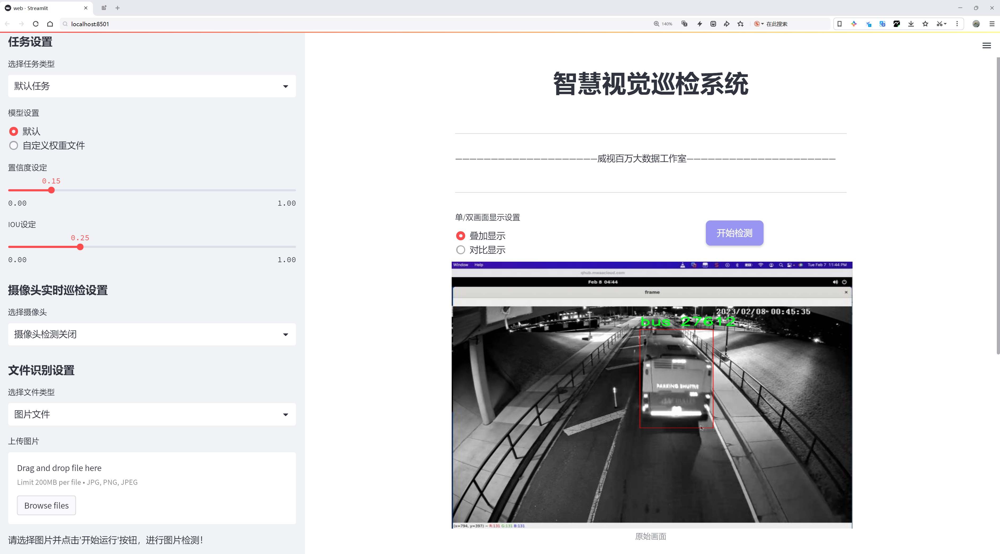
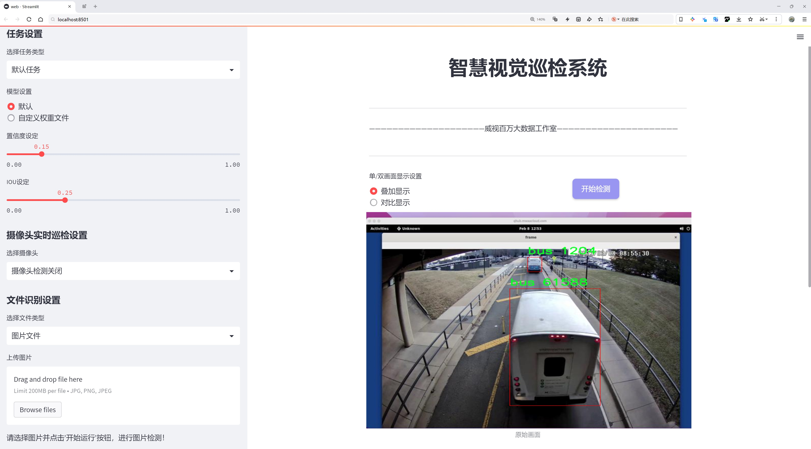
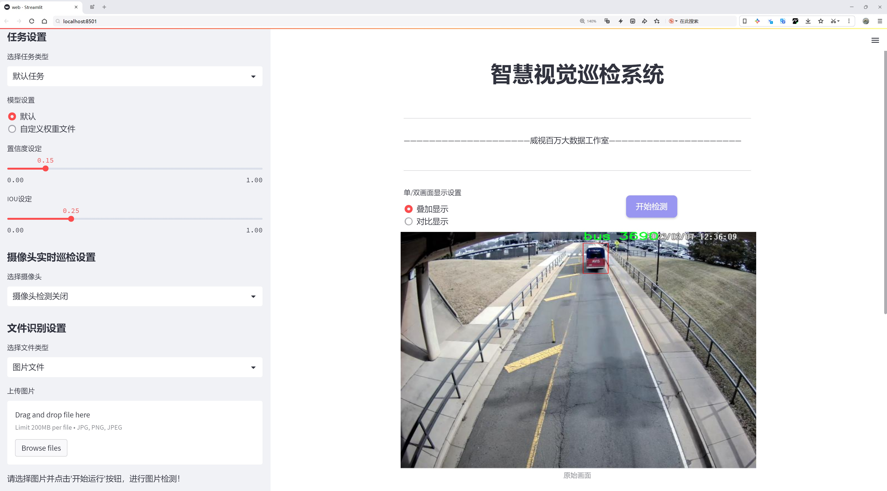
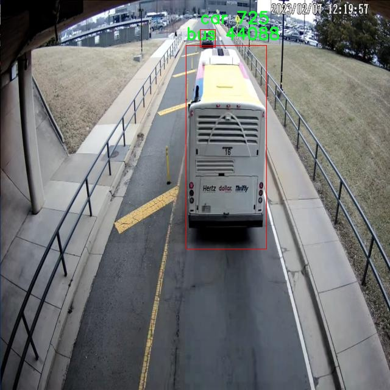
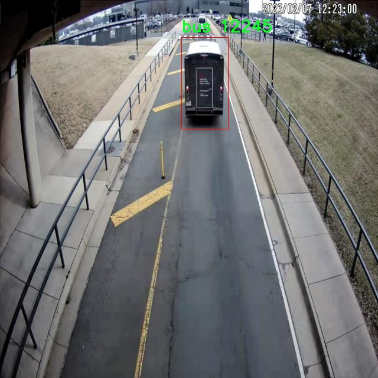
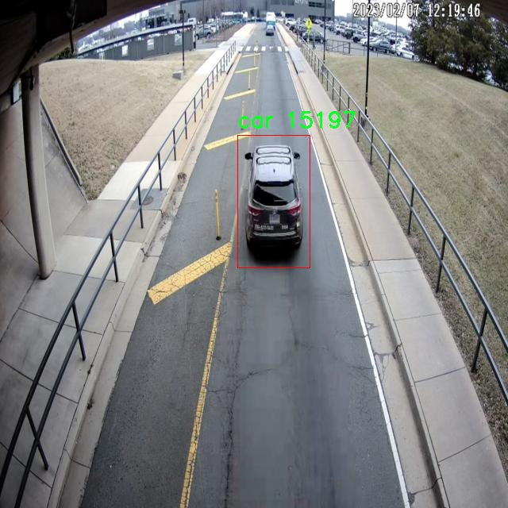
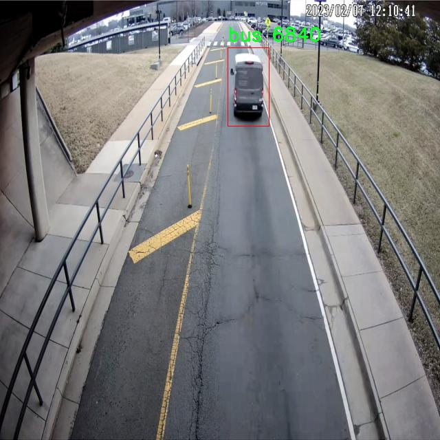
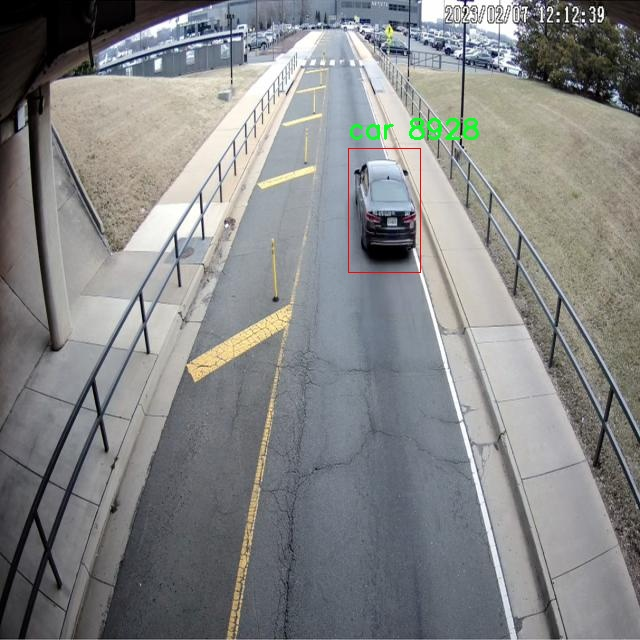

# 车辆检测与分类检测系统源码分享
 # [一条龙教学YOLOV8标注好的数据集一键训练_70+全套改进创新点发刊_Web前端展示]

### 1.研究背景与意义

项目参考[AAAI Association for the Advancement of Artificial Intelligence](https://gitee.com/qunshansj/projects)

项目来源[AACV Association for the Advancement of Computer Vision](https://gitee.com/qunmasj/projects)

研究背景与意义

随着城市化进程的加快和交通流量的不断增加，车辆检测与分类技术在智能交通系统、自动驾驶、交通监控等领域的应用日益广泛。传统的车辆检测方法往往依赖于手工特征提取和简单的分类器，面对复杂的交通环境和多样化的车辆类型，这些方法的准确性和鲁棒性均显得不足。因此，基于深度学习的目标检测技术应运而生，成为了当前研究的热点之一。YOLO（You Only Look Once）系列模型因其高效的实时检测能力和较高的准确率，已被广泛应用于各类目标检测任务中。YOLOv8作为该系列的最新版本，进一步提升了检测精度和速度，为车辆检测与分类提供了更为强大的技术支持。

在本研究中，我们基于改进的YOLOv8模型，构建了一套车辆检测与分类系统，旨在提高对不同类型车辆的识别能力。所使用的数据集包含3800张图像，涵盖了三类车辆：公交车、轿车和卡车。这一数据集的构建为模型的训练和评估提供了丰富的样本，能够有效地反映现实交通场景中的多样性和复杂性。通过对这些数据的深入分析和处理，我们可以更好地理解不同车辆在图像中的特征表现，从而优化模型的训练过程。

改进YOLOv8模型的关键在于其网络结构和训练策略的优化。我们将通过引入新的数据增强技术、调整网络参数、优化损失函数等手段，提升模型在车辆检测与分类任务中的表现。此外，针对不同车辆类别的特征差异，我们还将设计特定的特征提取模块，以增强模型对各类车辆的区分能力。这一系列改进不仅有助于提高检测精度，还能在实时应用中保持较低的延迟，为智能交通系统的实际部署提供技术保障。

本研究的意义不仅在于技术层面的创新，更在于其在实际应用中的潜在价值。随着智能交通系统的不断发展，车辆检测与分类技术的需求愈发迫切。通过构建高效的车辆检测与分类系统，我们能够为交通管理、事故预警、车辆监控等应用提供更为精准的数据支持，进而提升城市交通的安全性和效率。此外，本研究还将为后续的研究提供参考，推动相关领域的进一步探索与发展。

综上所述，基于改进YOLOv8的车辆检测与分类系统的研究，不仅具有重要的学术价值，也为实际应用提供了切实可行的解决方案。通过对车辆检测技术的深入研究，我们期待能够为智能交通系统的建设贡献一份力量，推动交通领域的智能化进程。

### 2.图片演示







##### 注意：由于此博客编辑较早，上面“2.图片演示”和“3.视频演示”展示的系统图片或者视频可能为老版本，新版本在老版本的基础上升级如下：（实际效果以升级的新版本为准）

  （1）适配了YOLOV8的“目标检测”模型和“实例分割”模型，通过加载相应的权重（.pt）文件即可自适应加载模型。

  （2）支持“图片识别”、“视频识别”、“摄像头实时识别”三种识别模式。

  （3）支持“图片识别”、“视频识别”、“摄像头实时识别”三种识别结果保存导出，解决手动导出（容易卡顿出现爆内存）存在的问题，识别完自动保存结果并导出到tempDir中。

  （4）支持Web前端系统中的标题、背景图等自定义修改，后面提供修改教程。

  另外本项目提供训练的数据集和训练教程,暂不提供权重文件（best.pt）,需要您按照教程进行训练后实现图片演示和Web前端界面演示的效果。

### 3.视频演示

[3.1 视频演示](https://www.bilibili.com/video/BV1bv4bedEbd/)

### 4.数据集信息展示

##### 4.1 本项目数据集详细数据（类别数＆类别名）

nc: 3
names: ['bus', 'car', 'truck']


##### 4.2 本项目数据集信息介绍

数据集信息展示

在本研究中，我们采用了名为“comexit”的数据集，以支持对YOLOv8模型在车辆检测与分类任务中的改进。该数据集专注于交通工具的识别，特别是公共交通和货运车辆，具有明确的应用背景和实用价值。数据集的类别数量为三，具体包括“bus”（公交车）、“car”（小汽车）和“truck”（卡车）。这三类车辆在城市交通和物流系统中扮演着重要角色，因此，准确的检测与分类对于交通管理、智能交通系统以及自动驾驶技术的发展具有重要意义。

“comexit”数据集的构建旨在提供多样化的样本，以确保模型在实际应用中的鲁棒性和准确性。数据集中包含了不同环境下的车辆图像，包括城市街道、高速公路、停车场等多种场景。这种多样性不仅涵盖了不同的光照条件和天气情况，还考虑到了不同的拍摄角度和距离，使得模型能够在各种复杂情况下进行有效的检测与分类。此外，数据集中的图像还包含了不同品牌和型号的车辆，进一步增强了模型的泛化能力。

为了确保数据集的质量，所有图像均经过精心挑选和标注。标注过程中，专业人员对每一张图像中的车辆进行了准确的框选，并标注了其类别。这种高质量的标注不仅提高了数据集的可靠性，也为后续的模型训练提供了坚实的基础。通过使用“comexit”数据集，我们能够有效地训练YOLOv8模型，使其在车辆检测与分类任务中达到更高的准确率和效率。

在数据集的使用过程中，我们将采用数据增强技术，以进一步提高模型的性能。通过对原始图像进行旋转、缩放、裁剪等操作，我们可以生成更多的训练样本，从而增强模型对不同场景和条件的适应能力。这种方法不仅能够提高模型的鲁棒性，还能有效防止过拟合现象的发生。

此外，数据集的划分策略也至关重要。我们将数据集分为训练集、验证集和测试集，以确保模型在训练过程中的有效评估。训练集用于模型的学习，验证集用于调整模型参数，而测试集则用于最终的性能评估。这种划分方式能够帮助我们全面了解模型在不同数据上的表现，从而为后续的优化提供指导。

综上所述，“comexit”数据集为改进YOLOv8的车辆检测与分类系统提供了丰富的资源和支持。通过精心设计的数据集结构和高质量的标注，我们期望能够提升模型在实际应用中的表现，为智能交通系统的发展贡献力量。随着研究的深入，我们相信该数据集将为未来的车辆检测与分类研究提供宝贵的参考和借鉴。











### 5.全套项目环境部署视频教程（零基础手把手教学）

[5.1 环境部署教程链接（零基础手把手教学）](https://www.ixigua.com/7404473917358506534?logTag=c807d0cbc21c0ef59de5)


[5.2 安装Python虚拟环境创建和依赖库安装视频教程链接（零基础手把手教学）](https://www.ixigua.com/7404474678003106304?logTag=1f1041108cd1f708b01a)

### 6.手把手YOLOV8训练视频教程（零基础小白有手就能学会）

[6.1 手把手YOLOV8训练视频教程（零基础小白有手就能学会）](https://www.ixigua.com/7404477157818401292?logTag=d31a2dfd1983c9668658)

### 7.70+种全套YOLOV8创新点代码加载调参视频教程（一键加载写好的改进模型的配置文件）

[7.1 70+种全套YOLOV8创新点代码加载调参视频教程（一键加载写好的改进模型的配置文件）](https://www.ixigua.com/7404478314661806627?logTag=29066f8288e3f4eea3a4)

### 8.70+种全套YOLOV8创新点原理讲解（非科班也可以轻松写刊发刊，V10版本正在科研待更新）

由于篇幅限制，每个创新点的具体原理讲解就不一一展开，具体见下列网址中的创新点对应子项目的技术原理博客网址【Blog】：


[8.1 70+种全套YOLOV8创新点原理讲解链接](https://gitee.com/qunmasj/good)

### 9.系统功能展示（检测对象为举例，实际内容以本项目数据集为准）

图9.1.系统支持检测结果表格显示

  图9.2.系统支持置信度和IOU阈值手动调节

  图9.3.系统支持自定义加载权重文件best.pt(需要你通过步骤5中训练获得)

  图9.4.系统支持摄像头实时识别

  图9.5.系统支持图片识别

  图9.6.系统支持视频识别

  图9.7.系统支持识别结果文件自动保存

  图9.8.系统支持Excel导出检测结果数据


### 10.原始YOLOV8算法原理

原始YOLOv8算法原理

YOLOv8（You Only Look Once version 8）作为YOLO系列的最新进展，代表了目标检测领域的一次重要技术革新。相较于以往的YOLO版本，YOLOv8在算法架构、特征提取、损失函数设计等多个方面进行了优化，旨在实现更高的检测精度和速度。其核心思想在于通过无锚框（anchor-free）的方法来简化目标检测过程，从而提升模型的性能。

YOLOv8的网络结构主要由输入端、主干网络、Neck端和输出端四个模块组成。输入端负责对输入图像进行预处理，包括Mosaic数据增强、自适应图片缩放和灰度填充等技术。这些预处理步骤不仅增强了模型的鲁棒性，还有效提高了其泛化能力。然而，YOLOv8在训练的最后阶段停止使用Mosaic数据增强，以避免破坏数据的真实分布，确保模型学习到更有价值的信息。

在主干网络中，YOLOv8采用了C2f模块替代了传统的C3模块。C2f模块引入了更多的跳层连接，借鉴了YOLOv7中的ELAN（Efficient Layer Aggregation Network）思想。这种设计不仅有助于丰富梯度流信息，还在保持模型轻量化的同时，提升了特征提取的效率。此外，YOLOv8依然保留了SPPF（Spatial Pyramid Pooling Fast）结构，以确保在特征提取过程中不牺牲性能。

Neck端的设计同样经过了优化，采用了基于路径聚合网络（PAN）的结构，通过上采样、下采样和特征拼接等方式融合不同尺度的特征图。这种特征融合方法能够有效提升模型对多尺度目标的检测能力，尤其是在复杂场景中，能够更好地处理小目标的检测问题。

在输出端，YOLOv8引入了解耦头（decoupled head）结构，将分类和回归任务分开处理。这种设计使得模型在处理分类任务时，可以更专注于特征图中提取到的特征与已知类别之间的相似性，而在定位任务中，则更加关注边界框与真实框之间的关系。这种侧重点的不同，使得模型在收敛速度和预测精度上都有了显著提升。

YOLOv8还采用了无锚框结构，直接预测目标的中心点，并通过任务对齐学习（Task-Aligned Learning）方法来区分正负样本。这一创新的思路使得模型在处理目标检测时，不再依赖于预设的锚框，而是通过自适应的方式进行目标定位，从而提高了模型的灵活性和适应性。

在损失函数的设计上，YOLOv8使用了BCE（Binary Cross-Entropy）计算分类损失，并结合DFL（Distribution Focal Loss）和CIoU（Complete Intersection over Union）损失函数来计算回归损失。这种多元化的损失计算方式，不仅提高了模型的泛化能力，还增强了其在复杂场景下的检测精度。

尽管YOLOv8在多个方面进行了优化，但在特定应用场景下，尤其是在复杂水面环境中，仍然存在一些挑战。例如，小目标漂浮物的特征复杂、背景多样，导致YOLOv8在定位精度和目标感知能力上存在不足。为了解决这些问题，研究者们提出了YOLOv8-WSSOD算法的改进方案。

YOLOv8-WSSOD算法通过引入BiFormer双层路由注意力机制构建C2fBF模块，以减轻主干网络下采样过程中的噪声影响。这一改进不仅保留了特征提取过程中更细粒度的上下文信息，还增强了模型对小目标的感知能力。此外，针对小目标漏检问题，YOLOv8-WSSOD在网络中添加了一个更小的检测头，以提升对小目标的检测能力。

在Neck端，YOLOv8-WSSOD引入了GSConv和Slim-neck技术，以保持模型的检测精度并降低计算量。这些技术的结合，使得YOLOv8-WSSOD在处理复杂背景和小目标时，能够更加高效和准确。

最后，YOLOv8-WSSOD使用MPDIoU损失函数替换了CIoU损失函数，进一步提高了模型的泛化能力和精准度。这一系列的改进，使得YOLOv8-WSSOD在复杂环境下的目标检测能力得到了显著提升，展现出更强的应用潜力。

综上所述，YOLOv8作为目标检测领域的一项重要创新，通过无锚框结构、解耦头设计和多元化损失函数等多项技术优化，显著提升了检测精度和速度。然而，在特定应用场景下仍需进一步改进，以满足更高的检测要求。YOLOv8-WSSOD算法的提出，为解决这些问题提供了新的思路和方法，预示着目标检测技术的未来发展方向。


### 11.项目核心源码讲解（再也不用担心看不懂代码逻辑）

#### 11.1 ui.py

以下是代码的核心部分，并附上详细的中文注释：

```python
import sys
import subprocess

def run_script(script_path):
    """
    使用当前 Python 环境运行指定的脚本。

    Args:
        script_path (str): 要运行的脚本路径

    Returns:
        None
    """
    # 获取当前 Python 解释器的路径
    python_path = sys.executable

    # 构建运行命令，使用 streamlit 运行指定的脚本
    command = f'"{python_path}" -m streamlit run "{script_path}"'

    # 执行命令
    result = subprocess.run(command, shell=True)
    
    # 检查命令执行结果，如果返回码不为0，表示执行出错
    if result.returncode != 0:
        print("脚本运行出错。")

# 实例化并运行应用
if __name__ == "__main__":
    # 指定要运行的脚本路径
    script_path = "web.py"  # 这里可以直接指定脚本名称

    # 调用函数运行脚本
    run_script(script_path)
```

### 代码说明：
1. **导入模块**：
   - `sys`：用于访问与 Python 解释器相关的变量和函数。
   - `subprocess`：用于执行外部命令。

2. **`run_script` 函数**：
   - 功能：接受一个脚本路径，使用当前 Python 环境运行该脚本。
   - 参数：`script_path` 是要运行的脚本的路径。
   - 获取当前 Python 解释器的路径，以便后续调用。
   - 构建命令字符串，使用 `streamlit` 模块运行指定的脚本。
   - 使用 `subprocess.run` 执行命令，并检查返回码以判断是否执行成功。

3. **主程序块**：
   - 当脚本作为主程序运行时，指定要运行的脚本路径（这里为 `web.py`）。
   - 调用 `run_script` 函数来执行指定的脚本。

这个程序文件 `ui.py` 的主要功能是通过当前的 Python 环境来运行一个指定的脚本，具体是使用 Streamlit 框架来启动一个 Web 应用。程序的结构比较简单，主要由几个部分组成。

首先，文件导入了一些必要的模块，包括 `sys`、`os` 和 `subprocess`。其中，`sys` 模块用于访问与 Python 解释器相关的变量和函数，`os` 模块提供了与操作系统交互的功能，而 `subprocess` 模块则用于创建新进程、连接到它们的输入/输出/错误管道，并获取它们的返回码。

接下来，程序定义了一个名为 `run_script` 的函数。这个函数接受一个参数 `script_path`，表示要运行的脚本的路径。在函数内部，首先获取当前 Python 解释器的路径，存储在 `python_path` 变量中。然后，构建一个命令字符串 `command`，这个命令使用当前的 Python 解释器和 Streamlit 模块来运行指定的脚本。具体来说，命令的格式是 `"{python_path}" -m streamlit run "{script_path}"`，这将会启动 Streamlit 应用。

随后，使用 `subprocess.run` 方法来执行这个命令。`shell=True` 参数表示在 shell 中执行命令。执行完命令后，程序检查返回码 `result.returncode`，如果返回码不为 0，表示脚本运行出错，程序会打印出错误信息。

最后，在文件的主程序部分，使用 `if __name__ == "__main__":` 来确保只有在直接运行该文件时才会执行以下代码。此处指定了要运行的脚本路径 `script_path`，它通过调用 `abs_path("web.py")` 来获取，这个函数可能是用来获取 `web.py` 文件的绝对路径。然后，调用 `run_script(script_path)` 来运行这个脚本。

总体来看，这个程序的目的是提供一个简单的接口，通过它可以方便地启动一个 Streamlit Web 应用，具体的应用逻辑则在 `web.py` 文件中实现。

#### 11.2 70+种YOLOv8算法改进源码大全和调试加载训练教程（非必要）\ultralytics\engine\__init__.py

当然可以！不过您提供的代码只有一行注释，并没有实际的代码逻辑。如果您能提供更多的代码内容，我将能够提取出核心部分并进行详细的中文注释。请您提供更完整的代码示例。

这个程序文件的开头部分包含了一条注释，说明了该文件属于Ultralytics YOLO项目，并且该项目遵循AGPL-3.0许可证。Ultralytics YOLO是一个用于目标检测的深度学习框架，YOLO（You Only Look Once）是一种高效的实时目标检测算法。AGPL-3.0许可证是一种开源许可证，允许用户自由使用、修改和分发软件，但要求在分发时也必须提供源代码。

虽然这个文件的代码非常简短，仅包含了一行注释，但它的存在表明了该文件是Ultralytics YOLO项目的一部分，可能涉及到与YOLOv8算法相关的功能或模块。通常，`__init__.py`文件用于将一个目录标识为Python包，使得该目录下的模块可以被导入和使用。

在整个YOLOv8算法改进源码的上下文中，这个文件可能是用于初始化一些必要的组件或设置，以便在后续的代码中能够顺利地调用YOLOv8的相关功能。虽然具体的实现细节在这段代码中并未体现，但可以推测它是整个项目架构中的一个基础部分，负责模块的组织和管理。

#### 11.3 70+种YOLOv8算法改进源码大全和调试加载训练教程（非必要）\ultralytics\nn\backbone\convnextv2.py

以下是提取出的核心代码部分，并附上详细的中文注释：

```python
import torch
import torch.nn as nn
import torch.nn.functional as F

class LayerNorm(nn.Module):
    """ 自定义的层归一化 (Layer Normalization) 实现，支持两种数据格式：channels_last 和 channels_first。 """
    def __init__(self, normalized_shape, eps=1e-6, data_format="channels_last"):
        super().__init__()
        # 权重和偏置参数
        self.weight = nn.Parameter(torch.ones(normalized_shape))
        self.bias = nn.Parameter(torch.zeros(normalized_shape))
        self.eps = eps  # 防止除零的微小值
        self.data_format = data_format  # 数据格式
        if self.data_format not in ["channels_last", "channels_first"]:
            raise NotImplementedError  # 如果数据格式不支持，抛出异常
        self.normalized_shape = (normalized_shape, )
    
    def forward(self, x):
        # 根据数据格式选择不同的归一化方式
        if self.data_format == "channels_last":
            return F.layer_norm(x, self.normalized_shape, self.weight, self.bias, self.eps)
        elif self.data_format == "channels_first":
            u = x.mean(1, keepdim=True)  # 计算均值
            s = (x - u).pow(2).mean(1, keepdim=True)  # 计算方差
            x = (x - u) / torch.sqrt(s + self.eps)  # 归一化
            x = self.weight[:, None, None] * x + self.bias[:, None, None]  # 应用权重和偏置
            return x

class Block(nn.Module):
    """ ConvNeXtV2 的基本模块，包含深度可分离卷积和前馈网络。 """
    def __init__(self, dim, drop_path=0.):
        super().__init__()
        # 深度可分离卷积
        self.dwconv = nn.Conv2d(dim, dim, kernel_size=7, padding=3, groups=dim)
        self.norm = LayerNorm(dim, eps=1e-6)  # 归一化层
        self.pwconv1 = nn.Linear(dim, 4 * dim)  # 1x1 卷积（使用线性层实现）
        self.act = nn.GELU()  # 激活函数
        self.pwconv2 = nn.Linear(4 * dim, dim)  # 另一个 1x1 卷积
        self.drop_path = nn.Identity() if drop_path <= 0. else DropPath(drop_path)  # 随机深度

    def forward(self, x):
        input = x  # 保存输入以便后续残差连接
        x = self.dwconv(x)  # 深度可分离卷积
        x = x.permute(0, 2, 3, 1)  # 转换维度顺序
        x = self.norm(x)  # 归一化
        x = self.pwconv1(x)  # 第一个 1x1 卷积
        x = self.act(x)  # 激活
        x = self.pwconv2(x)  # 第二个 1x1 卷积
        x = x.permute(0, 3, 1, 2)  # 恢复维度顺序
        x = input + self.drop_path(x)  # 残差连接
        return x

class ConvNeXtV2(nn.Module):
    """ ConvNeXt V2 模型定义。 """
    def __init__(self, in_chans=3, num_classes=1000, depths=[3, 3, 9, 3], dims=[96, 192, 384, 768], drop_path_rate=0.):
        super().__init__()
        self.downsample_layers = nn.ModuleList()  # 下采样层
        # Stem 部分
        stem = nn.Sequential(
            nn.Conv2d(in_chans, dims[0], kernel_size=4, stride=4),
            LayerNorm(dims[0], eps=1e-6, data_format="channels_first")
        )
        self.downsample_layers.append(stem)
        # 添加下采样层
        for i in range(3):
            downsample_layer = nn.Sequential(
                LayerNorm(dims[i], eps=1e-6, data_format="channels_first"),
                nn.Conv2d(dims[i], dims[i+1], kernel_size=2, stride=2),
            )
            self.downsample_layers.append(downsample_layer)

        self.stages = nn.ModuleList()  # 特征分辨率阶段
        dp_rates = [x.item() for x in torch.linspace(0, drop_path_rate, sum(depths))]  # 随机深度率
        cur = 0
        for i in range(4):
            stage = nn.Sequential(
                *[Block(dim=dims[i], drop_path=dp_rates[cur + j]) for j in range(depths[i])]
            )
            self.stages.append(stage)
            cur += depths[i]

        self.norm = nn.LayerNorm(dims[-1], eps=1e-6)  # 最后的归一化层
        self.head = nn.Linear(dims[-1], num_classes)  # 分类头

    def forward(self, x):
        res = []  # 保存每个阶段的输出
        for i in range(4):
            x = self.downsample_layers[i](x)  # 下采样
            x = self.stages[i](x)  # 通过当前阶段
            res.append(x)  # 保存输出
        return res  # 返回所有阶段的输出
```

以上代码展示了 ConvNeXtV2 模型的核心结构，包括自定义的层归一化、基本模块（Block）以及整个模型的定义。每个部分都有详细的中文注释，便于理解其功能和实现方式。

这个程序文件实现了ConvNeXt V2模型的构建和相关功能，主要用于计算机视觉任务，特别是图像分类。代码首先导入了必要的库，包括PyTorch和一些自定义的层。文件中定义了多个类和函数，具体功能如下：

首先，定义了一个`LayerNorm`类，该类实现了层归一化（Layer Normalization），支持两种数据格式：`channels_last`和`channels_first`。在`forward`方法中，根据输入数据的格式选择不同的归一化方式。

接着，定义了一个`GRN`类，表示全局响应归一化（Global Response Normalization）层。该层通过计算输入的L2范数来调整输入特征，并引入了可学习的参数`gamma`和`beta`。

然后，定义了一个`Block`类，表示ConvNeXt V2的基本构建块。这个块包含了深度可分离卷积、层归一化、点卷积、激活函数（GELU）和全局响应归一化等操作，并使用了随机深度（Drop Path）来提高模型的泛化能力。

接下来，定义了`ConvNeXtV2`类，这是整个模型的主体。该类初始化时接收输入通道数、类别数、每个阶段的块数、特征维度等参数。模型的构建包括一个stem层和多个下采样层，以及多个特征分辨率阶段，每个阶段由多个残差块组成。模型的最后部分是一个归一化层和一个线性分类头。

在`ConvNeXtV2`类中，还定义了一个`_init_weights`方法，用于初始化模型的权重。权重初始化采用了截断正态分布，并将偏置初始化为零。

此外，文件中还定义了一个`update_weight`函数，用于更新模型的权重字典，确保加载的权重与模型的结构匹配。

最后，提供了一系列函数（如`convnextv2_atto`、`convnextv2_femto`等），用于创建不同规模的ConvNeXt V2模型。这些函数可以选择性地加载预训练权重，便于模型的快速使用。

总体而言，这个文件提供了ConvNeXt V2模型的实现，包括模型的构建、权重初始化和加载等功能，适用于需要高效图像分类的深度学习任务。

#### 11.4 code\ultralytics\utils\tal.py

以下是代码中最核心的部分，并附上详细的中文注释：

```python
import torch
import torch.nn as nn

class TaskAlignedAssigner(nn.Module):
    """
    任务对齐分配器，用于目标检测。

    该类根据任务对齐度量将真实对象（ground-truth）分配给锚框（anchors），
    该度量结合了分类和定位信息。
    """

    def __init__(self, topk=13, num_classes=80, alpha=1.0, beta=6.0, eps=1e-9):
        """初始化任务对齐分配器对象，允许自定义超参数。"""
        super().__init__()
        self.topk = topk  # 考虑的候选框数量
        self.num_classes = num_classes  # 目标类别数量
        self.bg_idx = num_classes  # 背景类别索引
        self.alpha = alpha  # 分类组件的权重
        self.beta = beta  # 定位组件的权重
        self.eps = eps  # 防止除以零的小值

    @torch.no_grad()
    def forward(self, pd_scores, pd_bboxes, anc_points, gt_labels, gt_bboxes, mask_gt):
        """
        计算任务对齐分配。

        参数:
            pd_scores (Tensor): 预测的得分，形状为(bs, num_total_anchors, num_classes)
            pd_bboxes (Tensor): 预测的边界框，形状为(bs, num_total_anchors, 4)
            anc_points (Tensor): 锚框中心点，形状为(num_total_anchors, 2)
            gt_labels (Tensor): 真实标签，形状为(bs, n_max_boxes, 1)
            gt_bboxes (Tensor): 真实边界框，形状为(bs, n_max_boxes, 4)
            mask_gt (Tensor): 真实框的掩码，形状为(bs, n_max_boxes, 1)

        返回:
            target_labels (Tensor): 目标标签，形状为(bs, num_total_anchors)
            target_bboxes (Tensor): 目标边界框，形状为(bs, num_total_anchors, 4)
            target_scores (Tensor): 目标得分，形状为(bs, num_total_anchors, num_classes)
            fg_mask (Tensor): 前景掩码，形状为(bs, num_total_anchors)
            target_gt_idx (Tensor): 目标真实框索引，形状为(bs, num_total_anchors)
        """
        self.bs = pd_scores.size(0)  # 批量大小
        self.n_max_boxes = gt_bboxes.size(1)  # 最大框数量

        if self.n_max_boxes == 0:  # 如果没有真实框
            device = gt_bboxes.device
            return (
                torch.full_like(pd_scores[..., 0], self.bg_idx).to(device),  # 返回背景索引
                torch.zeros_like(pd_bboxes).to(device),  # 返回零边界框
                torch.zeros_like(pd_scores).to(device),  # 返回零得分
                torch.zeros_like(pd_scores[..., 0]).to(device),  # 返回零前景掩码
                torch.zeros_like(pd_scores[..., 0]).to(device),  # 返回零真实框索引
            )

        # 获取正样本掩码、对齐度量和重叠度
        mask_pos, align_metric, overlaps = self.get_pos_mask(
            pd_scores, pd_bboxes, gt_labels, gt_bboxes, anc_points, mask_gt
        )

        # 选择重叠度最高的真实框
        target_gt_idx, fg_mask, mask_pos = self.select_highest_overlaps(mask_pos, overlaps, self.n_max_boxes)

        # 获取目标标签、边界框和得分
        target_labels, target_bboxes, target_scores = self.get_targets(gt_labels, gt_bboxes, target_gt_idx, fg_mask)

        # 归一化对齐度量
        align_metric *= mask_pos
        pos_align_metrics = align_metric.amax(dim=-1, keepdim=True)  # 获取正样本的最大对齐度量
        pos_overlaps = (overlaps * mask_pos).amax(dim=-1, keepdim=True)  # 获取正样本的最大重叠度
        norm_align_metric = (align_metric * pos_overlaps / (pos_align_metrics + self.eps)).amax(-2).unsqueeze(-1)
        target_scores = target_scores * norm_align_metric  # 更新目标得分

        return target_labels, target_bboxes, target_scores, fg_mask.bool(), target_gt_idx

    def get_pos_mask(self, pd_scores, pd_bboxes, gt_labels, gt_bboxes, anc_points, mask_gt):
        """获取正样本掩码和对齐度量。"""
        mask_in_gts = self.select_candidates_in_gts(anc_points, gt_bboxes)  # 选择在真实框内的锚框
        align_metric, overlaps = self.get_box_metrics(pd_scores, pd_bboxes, gt_labels, gt_bboxes, mask_in_gts * mask_gt)  # 计算对齐度量和重叠度
        mask_topk = self.select_topk_candidates(align_metric, topk_mask=mask_gt.expand(-1, -1, self.topk).bool())  # 选择前k个候选框
        mask_pos = mask_topk * mask_in_gts * mask_gt  # 合并掩码

        return mask_pos, align_metric, overlaps

    def get_box_metrics(self, pd_scores, pd_bboxes, gt_labels, gt_bboxes, mask_gt):
        """计算预测边界框与真实边界框的对齐度量。"""
        na = pd_bboxes.shape[-2]  # 锚框数量
        mask_gt = mask_gt.bool()  # 转换为布尔类型
        overlaps = torch.zeros([self.bs, self.n_max_boxes, na], dtype=pd_bboxes.dtype, device=pd_bboxes.device)  # 初始化重叠度
        bbox_scores = torch.zeros([self.bs, self.n_max_boxes, na], dtype=pd_scores.dtype, device=pd_scores.device)  # 初始化边界框得分

        ind = torch.zeros([2, self.bs, self.n_max_boxes], dtype=torch.long)  # 创建索引
        ind[0] = torch.arange(end=self.bs).view(-1, 1).expand(-1, self.n_max_boxes)  # 批量索引
        ind[1] = gt_labels.squeeze(-1)  # 真实标签索引
        bbox_scores[mask_gt] = pd_scores[ind[0], :, ind[1]][mask_gt]  # 获取每个锚框的得分

        # 计算重叠度
        pd_boxes = pd_bboxes.unsqueeze(1).expand(-1, self.n_max_boxes, -1, -1)[mask_gt]
        gt_boxes = gt_bboxes.unsqueeze(2).expand(-1, -1, na, -1)[mask_gt]
        overlaps[mask_gt] = self.iou_calculation(gt_boxes, pd_boxes)  # 计算IoU

        align_metric = bbox_scores.pow(self.alpha) * overlaps.pow(self.beta)  # 计算对齐度量
        return align_metric, overlaps

    def iou_calculation(self, gt_bboxes, pd_bboxes):
        """计算边界框的IoU。"""
        return bbox_iou(gt_bboxes, pd_bboxes, xywh=False, CIoU=True).squeeze(-1).clamp_(0)  # 使用IoU函数计算重叠度

    def select_topk_candidates(self, metrics, largest=True, topk_mask=None):
        """根据给定的度量选择前k个候选框。"""
        topk_metrics, topk_idxs = torch.topk(metrics, self.topk, dim=-1, largest=largest)  # 获取前k个指标
        if topk_mask is None:
            topk_mask = (topk_metrics.max(-1, keepdim=True)[0] > self.eps).expand_as(topk_idxs)  # 创建掩码
        topk_idxs.masked_fill_(~topk_mask, 0)  # 填充无效索引

        count_tensor = torch.zeros(metrics.shape, dtype=torch.int8, device=topk_idxs.device)  # 初始化计数张量
        ones = torch.ones_like(topk_idxs[:, :, :1], dtype=torch.int8, device=topk_idxs.device)  # 创建全1张量
        for k in range(self.topk):
            count_tensor.scatter_add_(-1, topk_idxs[:, :, k : k + 1], ones)  # 更新计数张量
        count_tensor.masked_fill_(count_tensor > 1, 0)  # 过滤无效边界框

        return count_tensor.to(metrics.dtype)  # 返回计数张量

    def get_targets(self, gt_labels, gt_bboxes, target_gt_idx, fg_mask):
        """计算正样本的目标标签、边界框和得分。"""
        batch_ind = torch.arange(end=self.bs, dtype=torch.int64, device=gt_labels.device)[..., None]  # 批量索引
        target_gt_idx = target_gt_idx + batch_ind * self.n_max_boxes  # 更新目标真实框索引
        target_labels = gt_labels.long().flatten()[target_gt_idx]  # 获取目标标签

        target_bboxes = gt_bboxes.view(-1, gt_bboxes.shape[-1])[target_gt_idx]  # 获取目标边界框

        target_labels.clamp_(0)  # 限制标签范围

        target_scores = torch.zeros(
            (target_labels.shape[0], target_labels.shape[1], self.num_classes),
            dtype=torch.int64,
            device=target_labels.device,
        )  # 初始化目标得分
        target_scores.scatter_(2, target_labels.unsqueeze(-1), 1)  # 根据标签更新得分

        fg_scores_mask = fg_mask[:, :, None].repeat(1, 1, self.num_classes)  # 扩展前景掩码
        target_scores = torch.where(fg_scores_mask > 0, target_scores, 0)  # 更新得分

        return target_labels, target_bboxes, target_scores  # 返回目标标签、边界框和得分

    @staticmethod
    def select_candidates_in_gts(xy_centers, gt_bboxes, eps=1e-9):
        """选择在真实框内的正样本锚框。"""
        n_anchors = xy_centers.shape[0]  # 锚框数量
        bs, n_boxes, _ = gt_bboxes.shape  # 批量大小和真实框数量
        lt, rb = gt_bboxes.view(-1, 1, 4).chunk(2, 2)  # 获取左上角和右下角坐标
        bbox_deltas = torch.cat((xy_centers[None] - lt, rb - xy_centers[None]), dim=2).view(bs, n_boxes, n_anchors, -1)  # 计算锚框与真实框的距离
        return bbox_deltas.amin(3).gt_(eps)  # 返回在真实框内的锚框

    @staticmethod
    def select_highest_overlaps(mask_pos, overlaps, n_max_boxes):
        """选择重叠度最高的真实框。"""
        fg_mask = mask_pos.sum(-2)  # 计算前景掩码
        if fg_mask.max() > 1:  # 如果一个锚框分配给多个真实框
            mask_multi_gts = (fg_mask.unsqueeze(1) > 1).expand(-1, n_max_boxes, -1)  # 创建多重真实框掩码
            max_overlaps_idx = overlaps.argmax(1)  # 获取最大重叠度索引

            is_max_overlaps = torch.zeros(mask_pos.shape, dtype=mask_pos.dtype, device=mask_pos.device)  # 初始化最大重叠度掩码
            is_max_overlaps.scatter_(1, max_overlaps_idx.unsqueeze(1), 1)  # 更新最大重叠度掩码

            mask_pos = torch.where(mask_multi_gts, is_max_overlaps, mask_pos).float()  # 更新掩码
            fg_mask = mask_pos.sum(-2)  # 更新前景掩码
        target_gt_idx = mask_pos.argmax(-2)  # 获取目标真实框索引
        return target_gt_idx, fg_mask, mask_pos  # 返回目标真实框索引、前景掩码和掩码
```

以上代码是YOLO目标检测模型中的任务对齐分配器的核心部分。它的主要功能是根据预测的得分和边界框，将真实框分配给锚框，并计算相应的目标标签、边界框和得分。代码中包含了多个辅助函数，用于计算对齐度量、选择候选框等。

这个程序文件是一个用于目标检测的任务对齐分配器（TaskAlignedAssigner）的实现，属于Ultralytics YOLO（You Only Look Once）系列模型的一部分。该类的主要功能是根据任务对齐的度量，将真实的目标（ground-truth）对象分配给锚框（anchors），同时考虑分类和定位信息。

在这个类中，初始化方法定义了一些超参数，包括考虑的候选框数量（topk）、目标类别数量（num_classes）、分类和定位组件的权重（alpha和beta），以及一个小的常数（eps）以防止除以零的情况。

`forward`方法是类的核心，负责计算任务对齐的分配。它接收预测的分数、边界框、锚点、真实标签和边界框等信息，并返回目标标签、目标边界框、目标分数、前景掩码和目标索引。首先，该方法检查是否有真实目标，如果没有，则返回背景索引和零的张量。接着，它调用`get_pos_mask`方法获取正样本的掩码、对齐度量和重叠度量。然后，使用`select_highest_overlaps`方法选择重叠度量最高的目标，并调用`get_targets`方法获取目标标签、边界框和分数。最后，对齐度量进行归一化，并返回最终的目标信息。

`get_pos_mask`方法用于获取正样本的掩码，它通过选择在真实目标中的候选框、计算对齐度量和重叠度量来实现。`get_box_metrics`方法则计算给定预测和真实边界框的对齐度量。`iou_calculation`方法用于计算边界框的交并比（IoU），而`select_topk_candidates`方法用于根据给定的度量选择前k个候选框。

`get_targets`方法计算正样本锚点的目标标签、目标边界框和目标分数。`select_candidates_in_gts`方法用于选择在真实目标内的正样本锚点，而`select_highest_overlaps`方法确保每个锚框只分配给重叠度量最高的真实目标。

此外，文件中还定义了一个`RotatedTaskAlignedAssigner`类，继承自`TaskAlignedAssigner`，用于处理旋转边界框的情况。它重写了`iou_calculation`和`select_candidates_in_gts`方法，以适应旋转边界框的计算。

最后，文件中还包含一些辅助函数，如`make_anchors`用于生成锚框，`dist2bbox`和`bbox2dist`用于在不同表示形式之间转换边界框，`dist2rbox`用于解码预测的旋转边界框坐标。

总体而言，这个文件实现了一个复杂的目标检测任务分配机制，结合了分类和定位信息，以提高模型的性能。

#### 11.5 code\ultralytics\models\rtdetr\model.py

以下是代码中最核心的部分，并附上详细的中文注释：

```python
from ultralytics.engine.model import Model
from ultralytics.nn.tasks import RTDETRDetectionModel

class RTDETR(Model):
    """
    Baidu的RT-DETR模型接口。该基于视觉变换器的目标检测器提供实时性能和高准确性。
    支持高效的混合编码、IoU感知查询选择和可调的推理速度。
    """

    def __init__(self, model="rtdetr-l.pt") -> None:
        """
        使用给定的预训练模型文件初始化RT-DETR模型。支持.pt和.yaml格式。

        参数:
            model (str): 预训练模型的路径。默认为'rtdetr-l.pt'。

        异常:
            NotImplementedError: 如果模型文件扩展名不是'pt'、'yaml'或'yml'。
        """
        # 检查模型文件的扩展名是否为支持的格式
        if model and model.split(".")[-1] not in ("pt", "yaml", "yml"):
            raise NotImplementedError("RT-DETR只支持从*.pt、*.yaml或*.yml文件创建。")
        # 调用父类的初始化方法，设置模型和任务类型
        super().__init__(model=model, task="detect")

    @property
    def task_map(self) -> dict:
        """
        返回RT-DETR的任务映射，将任务与相应的Ultralytics类关联。

        返回:
            dict: 一个字典，将任务名称映射到RT-DETR模型的Ultralytics任务类。
        """
        return {
            "detect": {
                "predictor": RTDETRPredictor,  # 预测器类
                "validator": RTDETRValidator,  # 验证器类
                "trainer": RTDETRTrainer,      # 训练器类
                "model": RTDETRDetectionModel,  # 检测模型类
            }
        }
```

### 代码核心部分解释：
1. **导入必要的模块**：从`ultralytics`库中导入基础模型类和RT-DETR检测模型类。
2. **RTDETR类**：这是RT-DETR模型的主要接口，继承自`Model`类，提供目标检测功能。
3. **初始化方法**：在初始化时检查传入的模型文件格式，确保其为支持的格式（`.pt`、`.yaml`、`.yml`），并调用父类的初始化方法。
4. **任务映射属性**：定义了一个属性`task_map`，返回一个字典，映射不同的任务到相应的类，包括预测器、验证器、训练器和检测模型。这样可以方便地根据任务类型调用相应的功能。

这个程序文件是关于百度的RT-DETR模型的接口实现，RT-DETR是一种基于视觉变换器（Vision Transformer）的实时目标检测器，旨在提供高效的实时性能和高准确度，特别是在使用CUDA和TensorRT等加速后端时表现优异。文件中包含了模型的基本信息和一些关键功能的实现。

首先，文件引入了必要的模块，包括Ultralytics库中的Model类和RTDETRDetectionModel类，以及预测、训练和验证相关的模块。这些模块为RT-DETR模型的功能提供了基础。

RTDETR类继承自Model类，构造函数接受一个参数model，默认值为'rtdetr-l.pt'，这是预训练模型的路径。在初始化过程中，程序会检查模型文件的扩展名，确保它是支持的格式（.pt、.yaml或.yml）。如果文件格式不符合要求，程序会抛出NotImplementedError异常。

RTDETR类还定义了一个名为task_map的属性，该属性返回一个字典，映射了与RT-DETR模型相关的任务及其对应的Ultralytics类。这个字典包含了四个主要的任务：预测（predictor）、验证（validator）、训练（trainer）和模型（model），分别对应RTDETRPredictor、RTDETRValidator、RTDETRTrainer和RTDETRDetectionModel类。

总的来说，这个文件为RT-DETR模型提供了一个清晰的接口，便于用户进行目标检测任务的实现，同时也确保了模型的灵活性和可扩展性。通过使用这个接口，用户可以方便地加载预训练模型并进行相关的预测、训练和验证操作。

#### 11.6 train.py

以下是经过简化和注释的核心代码部分，主要集中在YOLO检测模型的训练过程中：

```python
import random
import numpy as np
import torch.nn as nn
from ultralytics.data import build_dataloader, build_yolo_dataset
from ultralytics.engine.trainer import BaseTrainer
from ultralytics.models import yolo
from ultralytics.nn.tasks import DetectionModel
from ultralytics.utils import LOGGER, RANK
from ultralytics.utils.torch_utils import de_parallel, torch_distributed_zero_first

class DetectionTrainer(BaseTrainer):
    """
    DetectionTrainer类，继承自BaseTrainer，用于基于YOLO模型的训练。
    """

    def build_dataset(self, img_path, mode="train", batch=None):
        """
        构建YOLO数据集。

        参数:
            img_path (str): 包含图像的文件夹路径。
            mode (str): 模式，可以是'train'或'val'，用于不同的数据增强。
            batch (int, optional): 批次大小，仅用于'rect'模式。默认为None。
        """
        gs = max(int(de_parallel(self.model).stride.max() if self.model else 0), 32)  # 获取模型的最大步幅
        return build_yolo_dataset(self.args, img_path, batch, self.data, mode=mode, rect=mode == "val", stride=gs)

    def get_dataloader(self, dataset_path, batch_size=16, rank=0, mode="train"):
        """构造并返回数据加载器。"""
        assert mode in ["train", "val"]  # 确保模式有效
        with torch_distributed_zero_first(rank):  # 在分布式训练中，确保数据集只初始化一次
            dataset = self.build_dataset(dataset_path, mode, batch_size)
        shuffle = mode == "train"  # 训练模式下打乱数据
        workers = self.args.workers if mode == "train" else self.args.workers * 2  # 设置工作线程数
        return build_dataloader(dataset, batch_size, workers, shuffle, rank)  # 返回数据加载器

    def preprocess_batch(self, batch):
        """对图像批次进行预处理，包括缩放和转换为浮点数。"""
        batch["img"] = batch["img"].to(self.device, non_blocking=True).float() / 255  # 将图像转换为浮点数并归一化
        if self.args.multi_scale:  # 如果启用多尺度训练
            imgs = batch["img"]
            sz = (
                random.randrange(self.args.imgsz * 0.5, self.args.imgsz * 1.5 + self.stride)
                // self.stride
                * self.stride
            )  # 随机选择新的图像大小
            sf = sz / max(imgs.shape[2:])  # 计算缩放因子
            if sf != 1:
                ns = [
                    math.ceil(x * sf / self.stride) * self.stride for x in imgs.shape[2:]
                ]  # 计算新的形状
                imgs = nn.functional.interpolate(imgs, size=ns, mode="bilinear", align_corners=False)  # 进行插值缩放
            batch["img"] = imgs  # 更新批次图像
        return batch

    def get_model(self, cfg=None, weights=None, verbose=True):
        """返回YOLO检测模型。"""
        model = DetectionModel(cfg, nc=self.data["nc"], verbose=verbose and RANK == -1)  # 创建检测模型
        if weights:
            model.load(weights)  # 加载权重
        return model

    def plot_training_samples(self, batch, ni):
        """绘制训练样本及其注释。"""
        plot_images(
            images=batch["img"],
            batch_idx=batch["batch_idx"],
            cls=batch["cls"].squeeze(-1),
            bboxes=batch["bboxes"],
            paths=batch["im_file"],
            fname=self.save_dir / f"train_batch{ni}.jpg",
            on_plot=self.on_plot,
        )
```

### 代码注释说明：
1. **类定义**：`DetectionTrainer`类继承自`BaseTrainer`，用于YOLO模型的训练。
2. **构建数据集**：`build_dataset`方法根据给定的图像路径和模式构建YOLO数据集，支持训练和验证模式。
3. **获取数据加载器**：`get_dataloader`方法构造数据加载器，确保在分布式训练中只初始化一次数据集。
4. **预处理批次**：`preprocess_batch`方法对输入图像进行预处理，包括归一化和可选的多尺度调整。
5. **获取模型**：`get_model`方法返回一个YOLO检测模型，并可选择加载预训练权重。
6. **绘制训练样本**：`plot_training_samples`方法用于可视化训练样本及其对应的标签和边界框。 

以上是核心代码部分的简化和注释，旨在帮助理解YOLO模型训练的主要流程。

这个程序文件 `train.py` 是一个用于训练目标检测模型的脚本，主要基于 YOLO（You Only Look Once）模型架构。它扩展了一个基础训练类 `BaseTrainer`，提供了针对目标检测任务的特定功能和方法。

首先，程序导入了一些必要的库和模块，包括数学运算、随机数生成、深度学习框架 PyTorch 相关的模块，以及 Ultralytics 提供的用于数据处理、模型构建和训练的工具。

在 `DetectionTrainer` 类中，定义了多个方法来支持数据集的构建、数据加载、模型的预处理、训练过程中的损失计算和可视化等功能。`build_dataset` 方法用于构建 YOLO 数据集，接受图像路径、模式（训练或验证）和批量大小作为参数。它使用 `build_yolo_dataset` 函数来生成数据集，支持不同模式下的增强处理。

`get_dataloader` 方法则用于构建数据加载器，确保在分布式训练时只初始化一次数据集。它会根据模式决定是否打乱数据，并根据工作线程数设置加载器的工作进程。

在数据预处理方面，`preprocess_batch` 方法将图像批量转换为浮点数并进行缩放处理，支持多尺度训练。`set_model_attributes` 方法用于设置模型的属性，包括类别数量和类别名称。

`get_model` 方法返回一个 YOLO 检测模型实例，并可选择加载预训练权重。`get_validator` 方法返回一个用于模型验证的验证器，跟踪训练过程中的损失。

`label_loss_items` 方法用于返回带有标签的训练损失字典，适用于分割和检测任务。`progress_string` 方法格式化并返回训练进度的字符串，包括当前的轮次、GPU 内存使用情况和损失值。

此外，程序还提供了可视化功能，包括 `plot_training_samples` 方法用于绘制训练样本及其标注，`plot_metrics` 方法用于从 CSV 文件中绘制训练指标，`plot_training_labels` 方法则用于创建带标签的训练图。

整体来看，这个文件实现了一个完整的目标检测模型训练流程，涵盖了数据处理、模型构建、训练过程监控和结果可视化等多个方面，适合于使用 YOLO 模型进行目标检测任务的开发者。

### 12.系统整体结构（节选）

### 整体功能和构架概括

该项目是一个基于YOLO（You Only Look Once）系列模型的目标检测框架，包含了多种模型架构和工具，旨在提供高效的目标检测解决方案。项目的主要功能包括模型的训练、验证、推理、数据处理和可视化等。整体架构由多个模块组成，每个模块负责特定的功能，以便于代码的组织和复用。

1. **模型构建**：实现了YOLOv8及其改进版本的模型结构，支持不同的网络架构（如ConvNeXt V2）。
2. **数据处理**：提供了数据集的构建和加载功能，支持数据增强和多尺度训练。
3. **训练和验证**：实现了训练过程的管理，包括损失计算、模型评估和指标监控。
4. **推理和可视化**：支持模型的推理过程，并提供可视化工具以展示训练样本和结果。
5. **工具和实用程序**：包含了一些实用的工具函数和类，便于开发和调试。

### 文件功能整理表

| 文件路径                                                                 | 功能描述                                                                                       |
|--------------------------------------------------------------------------|-----------------------------------------------------------------------------------------------|
| `D:\tools\20240809\code\ui.py`                                          | 启动Streamlit Web应用，提供一个简单的接口来运行YOLOv8相关的脚本。                           |
| `D:\tools\20240809\code\70+种YOLOv8算法改进源码大全和调试加载训练教程（非必要）\ultralytics\engine\__init__.py` | 初始化Ultralytics YOLO包，标识目录为Python包。                                               |
| `D:\tools\20240809\code\70+种YOLOv8算法改进源码大全和调试加载训练教程（非必要）\ultralytics\nn\backbone\convnextv2.py` | 实现ConvNeXt V2模型，包括基本构建块和模型的构建、权重初始化等功能。                         |
| `D:\tools\20240809\code\code\ultralytics\utils\tal.py`                | 实现目标检测的任务对齐分配器，负责将真实目标分配给锚框，计算分类和定位信息。                 |
| `D:\tools\20240809\code\code\ultralytics\models\rtdetr\model.py`      | 提供RT-DETR模型的接口，支持模型的加载和任务分配。                                           |
| `D:\tools\20240809\code\train.py`                                       | 实现目标检测模型的训练流程，包括数据集构建、模型训练、损失计算和可视化等功能。             |
| `D:\tools\20240809\code\code\ultralytics\models\yolo\detect\val.py`   | 实现YOLO模型的验证功能，评估模型在验证集上的性能。                                         |
| `D:\tools\20240809\code\code\ultralytics\utils\loss.py`               | 定义损失函数，用于训练过程中计算模型的损失值。                                               |
| `D:\tools\20240809\code\code\ultralytics\nn\modules\__init__.py`      | 初始化神经网络模块，标识目录为Python包。                                                     |
| `D:\tools\20240809\code\code\ultralytics\utils\callbacks\hub.py`      | 提供回调函数，用于在训练过程中执行特定操作，如保存模型和监控训练进度。                     |
| `D:\tools\20240809\code\code\__init__.py`                              | 初始化项目包，标识目录为Python包。                                                           |
| `D:\tools\20240809\code\code\ultralytics\models\yolo\pose\__init__.py`| 初始化YOLO姿态估计模块，标识目录为Python包。                                               |
| `D:\tools\20240809\code\70+种YOLOv8算法改进源码大全和调试加载训练教程（非必要）\ultralytics\data\build.py` | 实现数据集的构建功能，支持数据增强和处理。                                                  |

这个表格总结了项目中各个文件的主要功能，帮助理解项目的整体结构和各个模块之间的关系。

注意：由于此博客编辑较早，上面“11.项目核心源码讲解（再也不用担心看不懂代码逻辑）”中部分代码可能会优化升级，仅供参考学习，完整“训练源码”、“Web前端界面”和“70+种创新点源码”以“13.完整训练+Web前端界面+70+种创新点源码、数据集获取”的内容为准。

### 13.完整训练+Web前端界面+70+种创新点源码、数据集获取


# [下载链接：https://mbd.pub/o/bread/ZpuUmpxy](https://mbd.pub/o/bread/ZpuUmpxy)